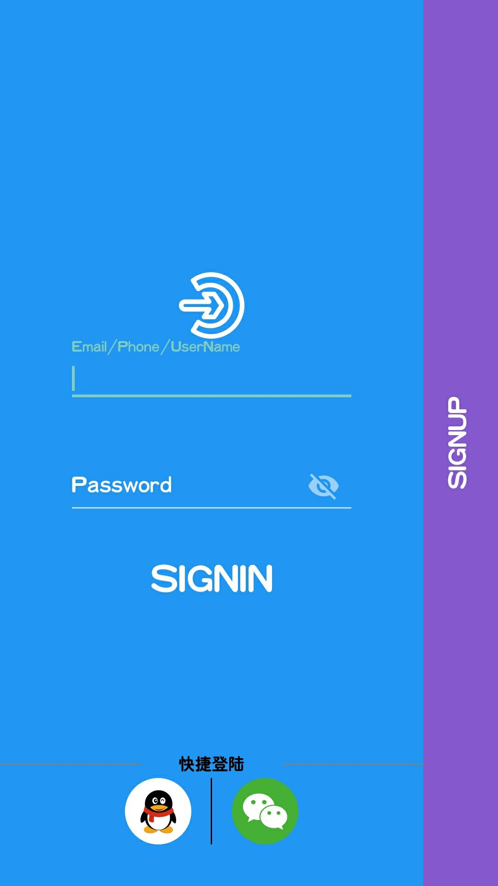

[TOC]
# SignInAndSingUp
一个使用kotlin基于androidx编写的登陆注册的界面  
- 功能：
  - 支持账号密码登录
  - 集成QQ微信快捷登录
- 使用 
  - QQ登录
    - 需要在[AndroidManifest](./app/src/main/AndroidManifest.xml)修改为你的开放平台获取的APPID
    - 在[SignActivity](./java/com/mml/signinandup/SignActivity.kt)修改APP_ID
  - 微信 
    - 修改[SignActivity](./java/com/mml/signinandup/SignActivity.kt)里的WX_APP_ID
# 界面展示
  - 登录 
     
  - 注册 
      
  - 动图 
    

# 试用（demo下载）
  - [demoAPK](https://www.pgyer.com/mrdf)

# bug fix
- 修复在魅族手机系统出现Attempt to invoke virtual method 'int android.text.Layout.getLineForOffset(int)' on a null object reference错误
TextInputEditText改为EditText

